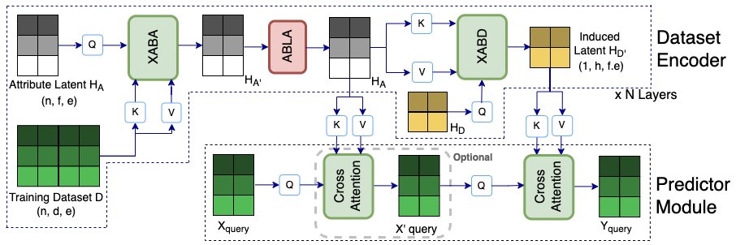

# Semi-Parametric Inducing Point Networks and Neural Process

| **[Installation](#installation)**
| **[Examples](#examples)**
| **[Citation](#citation)**




This repo implements the experiments for UCI and genomics dataset for our paper [Semi-Parametric Inducing Point Networks and Neural Process](https://openreview.net/forum?id=FE99-fDrWd5).
For experiments with SPIN Neural Processes please see [SPIN Neural Processes repo](https://github.com/yair-schiff/IPNP) 

## Acknowledgements

This repo uses [NPT](https://arxiv.org/pdf/2106.02584.pdf) codebase and framework https://github.com/OATML/non-parametric-transformers  and modifies the NPT architecture to inducing point architecture, which we call SPIN

## Installation

Set up and activate the Python environment by executing

```
conda env create -f environment.yml
conda activate npt
```
Scripts in the paper are stored in ```./scripts/SPIN_scripts.sh```. 

SLURM system can be used to run jobs. An example script for submitting SLURM job is given in ```./scripts/combined_sbatch.sub```.
In the scripts folder, customize the script ```init_env.sh``` for your environment and path. This path is then referenced in ```./scripts/combined_sbatch.sub``` .For imputation experiments, the data link for vcf file, marker panel, test and validation samples is specified in the ```./scripts/init_env.sh``` script.


## Examples
For running genomics experiments, the vcf file ("chr20.1kg.phase3.v5a.vcf.gz") from http://bochet.gcc.biostat.washington.edu/beagle/1000_Genomes_phase3_v5a/b37.vcf/ and

Human omni marker panel ("HumanOmni2-5-8-v1-1-C-b37.strand") from  https://www.well.ox.ac.uk/~wrayner/strand/ are used.

We have processed these raw files and they can be downloaded from google drive links below

[1000 genomes train/val/test csv files](https://drive.google.com/drive/u/0/folders/1t7UP1Fy9RmQeg-E3NhZKjv5I44HqCOAM)

[human omni marker panel](https://drive.google.com/drive/u/0/folders/1Z75sDGBJyld9nMKidBBMTHLJsEEZg5Fa)

[cleaned chromosome 20 snps in chunks of 10K snps per file](https://drive.google.com/drive/u/0/folders/1d3gBIpDmozOc-_LS-8vxZcs2RvjvqAZS)


Specify their location in ```./scripts/init_env.sh``` for the following environment variables
```
USER_PATH: local directory path where the repo exists
LOG_PATH: path for logs
DATA_IN: path where genomics input data - specifically - human omni marker panel and train/val/test splits for 1000 genomes dataset is stored
CLEANED_CHR20_SNPS: path where cleaned and processed snps for genomic data are stored
DATA_OUT: path where model checkpoint will be stored
ENV_NAME: name of the conda environment
```

```
python run.py --data_set imputation \
--exp_batch_size 256 \
--SPIN True --startAttBlock ABA --num_inds_I 10 --num_inds_F 10 --project Genotype_Imputation
```
SPIN is the configuration of SPIN that uses XABD, XABA and ABLA (on H_A) by default. 

The number of inducing points for datapoints (h in the paper) is configured by num_inds_I and number of inducing points for attributs (f in the paper) is configured by num_inds_F

## Citation
If you find SPIN useful for your research, please consider citing our paper:
```
@inproceedings{
rastogi2023semi,
title={Semi Parametric Inducing Point Networks},
author={Richa Rastogi and Yair Schiff and Alon Hacohen and Zhaozhi Li and Ian Lee and Yuntian Deng and Mert R. Sabuncu and Volodymyr Kuleshov},
booktitle={International Conference on Learning Representations},
year={2023},
url={https://openreview.net/forum?id=FE99-fDrWd5}
}
```

## Feedback
For any questions/feedback regarding this repo, please contact [here](rr568@cornell.edu)